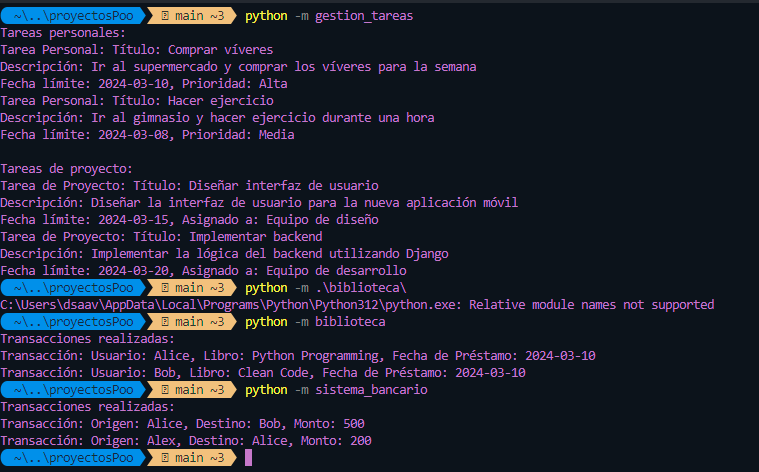

# Proyectos de Gestión

## Descripción

Este repositorio contiene varios proyectos de gestión desarrollados en Python utilizando programación orientada a objetos (POO). Cada proyecto aborda una problemática específica y proporciona una solución que se puede ejecutar desde la línea de comandos.

## Proyectos Disponibles

### Sistema de Gestión de Biblioteca

Un sistema que permite a los usuarios buscar, prestar y devolver libros, así como administrar el inventario de la biblioteca.

### Aplicación de Gestión de Tareas

Una aplicación que permite a los usuarios crear, organizar y seguir el progreso de sus tareas y proyectos.

### Simulador de Sistema Bancario

Un sistema que simula las operaciones bancarias básicas, como depósitos, retiros y transferencias, para clientes y empleados del banco.

### Plataforma de Gestión de Proyectos

Una plataforma en línea que permite a los equipos colaborar, asignar tareas, realizar seguimientos y gestionar proyectos de manera eficiente.

## Mejoras Potenciales

Los proyectos actuales pueden mejorarse aún más agregando características adicionales para una mejor interactividad y funcionalidad. Algunas mejoras potenciales incluyen:

- **Integración de la función `input`:** Agregar la función `input` en puntos clave del código para permitir una mayor interactividad con el usuario. Por ejemplo:

  - En el Sistema de Gestión de Biblioteca, se puede agregar la función `input` para que los usuarios ingresen información al buscar libros o realizar transacciones. 
  - En la Aplicación de Gestión de Tareas, se puede utilizar `input` para permitir a los usuarios agregar, eliminar o actualizar tareas directamente desde la línea de comandos.

- **Mejoras en la interfaz de usuario:** Diseñar una interfaz de usuario más intuitiva y fácil de usar para los proyectos. Esto puede implicar la creación de menús interactivos, pantallas de inicio amigables y mensajes claros de retroalimentación para los usuarios.

- **Implementación de características adicionales:** Agregar nuevas características y funcionalidades a los proyectos para mejorar su utilidad y versatilidad. Por ejemplo:

  - En el Simulador de Sistema Bancario, se pueden agregar opciones para realizar consultas de saldo, generar estados de cuenta o administrar cuentas de usuario.

## Ejecución de los Proyectos

Para ejecutar cualquiera de los proyectos, sigue los siguientes pasos:

1. Abre una terminal.
2. Navega hasta el directorio raíz del proyecto que deseas ejecutar.
3. Ejecuta el comando `python -m nombre_del_proyecto`.

Por ejemplo:

- `python -m biblioteca` para ejecutar el Sistema de Gestión de Biblioteca.
- `python -m gestion_tareas` para ejecutar la Aplicación de Gestión de Tareas.

¡Disfruta explorando los proyectos de gestión!
